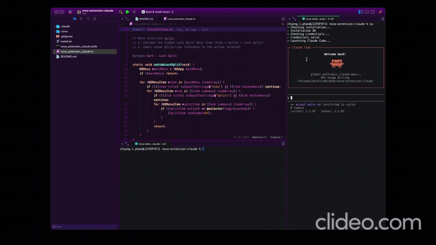
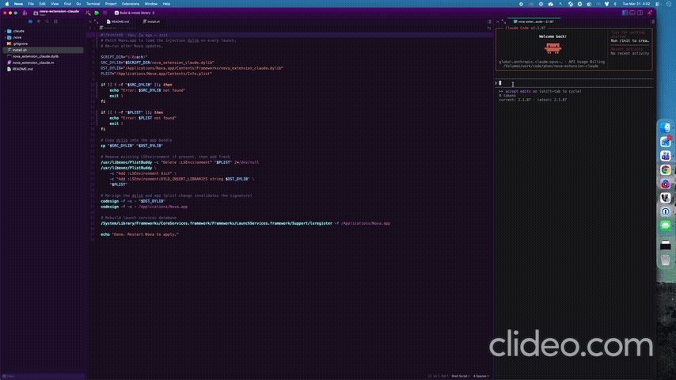

# Nova Extension Claude

Enhancements for [Nova](https://nova.app) by Panic, injected via a dylib. Designed for use with Claude Code.

### Before



### After



## Features

### 1. Lock Split

Nova has a fully implemented but hidden **Lock Split** feature. When you lock a split, files opened from the sidebar skip that split and open in an unlocked one instead. This lets you keep a terminal pinned without it getting replaced.

The dylib unhides the menu item at **View > Splits > Lock Split**. Lock and unlock via the menu.

### 2. Send File Ref to Terminal (Cmd+L)

Sends the current file reference to the active terminal. Works from:
- **Editor**: sends `@file:line ` or `@file:start-end ` for selections
- **Sidebar file**: sends `@file `
- **Sidebar folder**: sends `@folder `
- **Multiple selection**: sends space-separated refs

Paths are relative to the workspace root. A trailing space is appended so you can continue typing.

### 3. System Dictation in Terminal

Enables macOS system dictation to work in Nova's terminal. Press the mic/dictation key and speak. Text streams into the terminal as you talk, with Apple's built-in auto-correction.

- Press the mic key to start dictating
- Text appears in real-time as you speak
- Auto-correction happens automatically when dictation commits
- Final corrected text replaces the streaming text seamlessly

This is the same dictation engine used in every native macOS text field, just patched to work in Nova's terminal where it normally refuses to activate.

## How It Works

A single Objective-C dylib loaded into Nova at launch via `DYLD_INSERT_LIBRARIES`.

**Dictation fix**: Nova's terminal uses `PMTCanvas` as the first responder. macOS dictation refuses to activate because `selectedRange` returns `{NSNotFound, 0}` (no valid cursor) and `hasMarkedText` gets stuck returning YES after typing. The dylib patches `PMTCanvas` to fix both, then intercepts `setMarkedText:` (Apple's streaming dictation protocol) and replays the text into the terminal using DEL character (0x7F) erasure between updates. When dictation commits via `insertText:`, the streaming text is erased and replaced with the final auto-corrected result. You can freely mix typing and dictation.

No bytes are patched in the Nova binary. The dylib is copied into `Nova.app/Contents/Frameworks/` and loaded via `LSEnvironment` in `Info.plist`. The app is re-signed ad-hoc.

## Build

```sh
clang -arch arm64 -arch x86_64 -mmacosx-version-min=12.0 -dynamiclib -framework Cocoa -lobjc -o nova_extension_claude.dylib nova_extension_claude.m
```

## Install

```sh
./install.sh
```

Re-run after Nova updates.

## Compatibility

- Universal binary (arm64 + x86_64), macOS 12+
